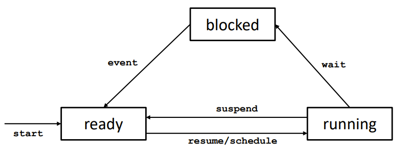

# Lecture 1

The turing machine did not have concurrency.

The first mechanical computer was Eniac (1945)

What happens if two users print simultaneously?

Types of concurrency:
Exploitation:
Hidden (virtual):
Inherent:

Q: What kind of concurrency is requesting a web-page from a server?
A: Fetching a web page is an example of inherent concurrency.

The thread has access to shared and local memory.


Concurrency: Interleaved execution, can run on a single core or multiple.
Parallelism: Simultaneous execution, requires multiple cores.

Parallelism example: Tivoli entrance.

We want to count the number of guests entering.
We have multiple turnstiles, each turnstile has a counter.
We need to syncronize the counters to get the total number of guests.

We have two counters incrementing our shared memory counter in a for loop 10_000 times on two threads.

Min value: ?
Max value: 20_000

## Atomicity

An operation is atomic if it appears to be executed in a single step.

Problem: counter++ is executed in multiple steps.

```java
int temp = counter;
counter = temp + 1;
```

> Beware: Just because a program statement is a single line, does not mean it is executed in a single step.

## States of a thread



It can either be ready, running or blocked.

When calling `.start()`, the thread goes into the ready state.

Then, the thread can be scheduled by the operating system scheduler to run.

In the running state, the thread is executing the code.

It can be blocked if it is suspended by the operating system or by itself using `Thread.sleep()`.

Sometimes we want the thread to wait for a certain condition to be true. Then it goes into the blocked state. This happens if we use `.join()` among other calls.

## Non-determinism

In operating systems or in runtime environments such as JVM a scheduler is used to determine which thread to run next.

The scheduler is non-deterministic, meaning that we cannot predict which thread will run next.

## Interlearning syntax

When asked about interleaving, use the following synstax:

```html
<thread
  >(<step
    >), <thread>(<step>), …</step></thread></step
  ></thread
>
```

Example:


## Race condition

When the result of a computation depends on the order of execution of threads.

## Data race

When two concurrent threads

- Access the same memory location
- At least one access is a write

## Critical section

A section of code that accesses shared memory. This section should be executed sequentially. This is done using locks.

## Mutual exclusion property

Mutual exclusion

Two threads cannot execute their critical sections at the same time.

Absence of deadlock
Threads will eventually exit their critical section.

Absence of starvation: if a thread is ready to enter the critical section, it will eventually enter.

## Classification of concurrency

### Inherent (User interfaces)

- User interfaces, keeping heavy work off the main thread.

### Exploitation

Examples:

- Multi-core processors
- Distributed systems

### Hidden

Examples:

- Virtualization / Shared resources
