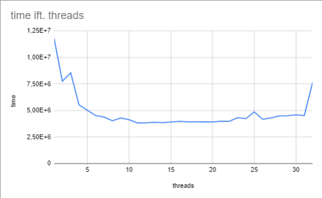

# Exercise 8.1

## 1

We did not observe any "strangeness". The results made sense, the more repetitions, the lower standard deviation.


## 2

We changed the test to use Mark7 and ran it using:

```bash
gradlew -PmainClass=exercises08.TestTimeThreads run > 8.1.2.txt
```

See 8.1.2.txt for system information

As for differences, thread creation for us is 1140 ns, which is twice as much as in the slides (600 ns)
This can be due to machine differences, background processes.

## 3

Creating a thread takes on this computer average 1140.3 ns +- 8.51 ns.

# Exercise 8.2

```bash
gradlew -PmainClass=exercises08.TestVolatile run > 8.2.txt
```

Results are reported in 8.2.txt

We expected that using a volatile would be slower, as marking a variable as volatile forces the thread to read the variable from memory every time it is accessed.

However, this is not what we observed. We observed exactly the same times, even across 134_217_728 runs.

Therefore, we would argue that the results are not plausible as they do not match our expectations. We were very surprised, but we have a theory the the JIT compiler of Java tries to optimize, since it might realize that the volatile variable is not being changed by any other thread and therefore can be kept in higher levels of memory.

# Exercise 8.3

## 1

```bash
gradlew -PmainClass=exercises08.TestCountPrimesThreads run > 8.3.txt
```

See results reported in 8.3.txt

## 2

We observed that the optimal amount of threads is 12, which makes sense as the computer has 12 cores (6 physical, 12 logical due to hyperthreading).

We plotted the times vs. cores on the following diagram:



# Exercise 8.4

## 1

We assumed that there was a mistake in the exercise description, where it said to use the LongCounter, instead of the PrimeCounter. We implemented the methods in the PrimeCounter.java class.


## 2

Results are reported in 8.4.2.txt

There are 1949 upper and lower case ipsum's in the file.
There are 1663 lower case ipsum's.
There are 1430 ipsum's succeeded by a space.

The value found is 1430.

The implementation works by splitting on spaces, so any punctuation or casing would break the match.

## 3

```bash
gradlew -PmainClass=exercises08.TestTimeSearch run > 8.4.3.txt
```

Results are reported in 8.4.3.txt

## 4


