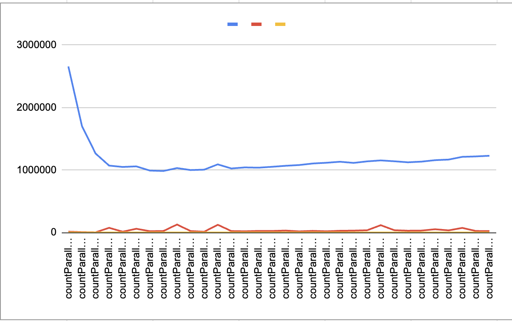
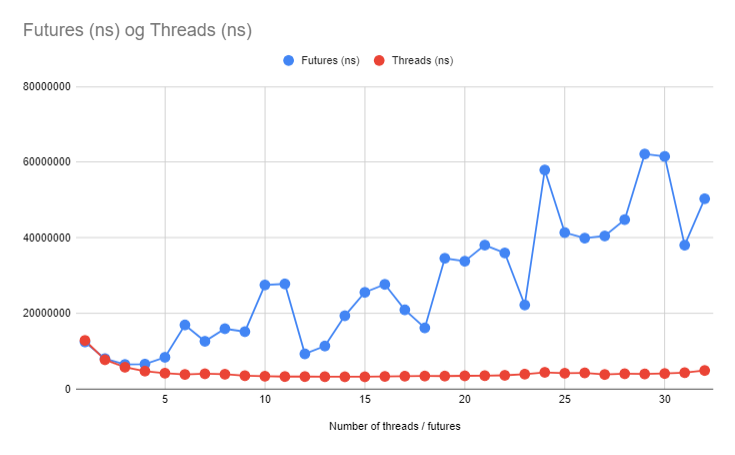
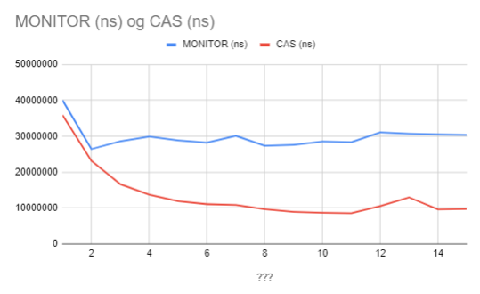

# Exercise 9.1

## 9.1.1

| N  | Time (ns)      | Stdev       | Count |
|----|----------------|-------------|-------|
| 5  | 310,695,115.0  | 1,678,387.85| 2     |
| 10 | 629,814,785.0  | 7,043,104.37| 2     |
| 15 | 933,802,035.0  | 1,601,354.66| 2     |

## 9.1.2

The problem is that if two different threads were to attempt to transfer between the same accounts at the same time.

Thread 1 wants to transfer from account 1 to account 2
Thread 2 wants to transfer from account 2 to account 1

If we just start by locking the source (Thread 1: 1, Thread 2: 2), each thread would lock and wait for other to be free, but it would never be free since we have created a deadlock. By having comparable id's we can ensure that the threads will always lock the accounts in the same order and therefore never step on each others toes.

## 9.1.3

We did it.


# Exercise 9.2

## 1 and 2

```python
import math


def main():
    n = 1_000_000
    n2 = 10_000_000
    print(est_16(n))
    print(est_32(n))
    print(est_16(n2))
    print(est_32(n2))


def est_16(n):
    return (n * math.log2(n)) / (
        n + n / 2 + n / 4 + n / 8 + math.log2(n / 16) * (n / 16)
    )


def est_32(n):
    return (n * math.log2(n)) / (
        n + n / 2 + n / 4 + n / 8 + n / 16 + math.log2(n / 32) * (n / 32)
    )


if __name__ == "__main__":
    main()
```

Output:
```bash
6.943048257275727 // 16 core, 1 million elements
8.290617311976854 // 32 core, 1 million elements
7.553899150833834 // 16 core, 10 million elements
9.272018344175157 // 32 core, 10 million elements
```

# Exercise 9.3

## 9.3.1

We noticed that it performs optimally at around 8 threads. After that, it gets slightly worse over time.



## 9.3.2

We discovered that futures scale poorly compared to threads.



# Exercise 9.4


```
monitor            40016418,8 ns 4602168,92          8
monitor            26435738,1 ns  837803,20         16
monitor            28621368,1 ns  520883,41         16
monitor            29922865,0 ns 1361688,43          8
monitor            28821450,6 ns  864382,28         16
monitor            28215873,8 ns 1513591,71         16
monitor            30108815,6 ns 2760797,16         16
monitor            27362582,5 ns 1884889,80          8
monitor            27605561,9 ns 1724559,17         16
monitor            28536451,9 ns 1763922,01         16
monitor            28326006,3 ns 1558287,94         16
monitor            31076501,3 ns 1531596,89          8
monitor            30694113,8 ns  700631,29         16
monitor            30527546,9 ns  302536,50         16
monitor            30397011,3 ns  353388,33         16
CAS                  35846343,8 ns  376944,70          8
CAS                  23153906,9 ns  663143,87         16
CAS                  16651490,0 ns  354144,18         16
CAS                  13745219,7 ns  214569,04         32
CAS                  11900870,9 ns  342270,89         32
CAS                  11078974,4 ns  719204,20         32
CAS                  10846680,3 ns  327759,36         32
CAS                   9659075,3 ns  151588,45         32
CAS                   8951717,2 ns  237450,09         32
CAS                   8698788,4 ns  334434,82         32
CAS                   8551646,3 ns  368193,45         32
CAS                  10523884,7 ns 1725958,09         32
CAS                  12943580,6 ns 5354035,54         16
CAS                   9601722,2 ns  530519,13         32
CAS                   9742906,9 ns 1081265,29         32
```


